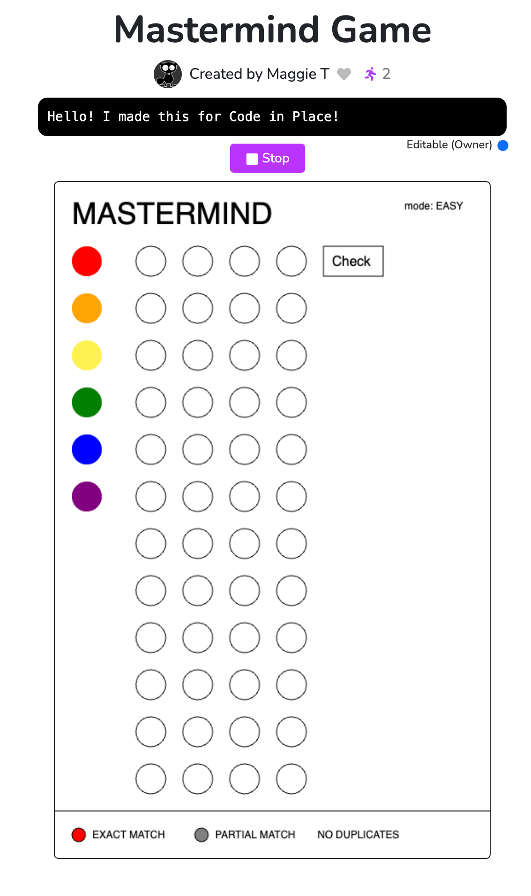

# Mastermind

Play the classic game of Mastermind [here](https://codeinplace.stanford.edu/cip4/share/53kI3TMUXJqWFKNPkVGC).

For the tablet-friendly version, click [here](https://codeinplace.stanford.edu/cip4/share/B2IY1YJYyVZNcSg8LeNe). (It does not appear to work very well on the phone, the mouse positions seems off)



## Project Proposal

### Milestones

#### Set Up Your Graphics Canvas

Initialize the graphics canvas where game elements will be displayed. Create the basic layout including the rows for guess pegs, the palette for selecting colors, and areas for key pegs.

#### Create Color Palette and Selection Mechanism

Design the color palette with six colors and set up the functionality that allows the player to select a color by clicking on it. Represent the selected color visually and store it for later use.

#### Generate the Secret Code

Write a function that randomly selects four colors from your list of six colors to form the secret code, ensuring there are no duplicates. Store this code in a list for use throughout the game.

#### Track Player Guesses

Design the code pegs where players will click to place their guesses. Implement logic to record the player's selected colors in the appropriate locations. Also, set up a variable to track the number of tries left.

#### Check Guesses and Provide Feedback

Write a function to compare the player's guess to the secret code. Use lists to keep track of which colors are in the correct position and which are the correct color but in the wrong position. Display the feedback using key pegs (red for correct color and position, grey for correct color but wrong position).

#### Display End Game Message

Create the logic to display either a 'You Win' or 'Game Over' message based on whether the player successfully guesses the code or exhausts all their tries. Reveal the secret code when the game ends.

#### Testing and Debugging

Carefully test each part of your game: start with canvas rendering, color selection, guess placement, feedback mechanism, and end-game conditions. Fix any bugs that arise and ensure that the game flows smoothly.

Polish and Extend
If time permits, add enhancements like allowing duplicate colors in the secret code, increasing the number of code pegs, or adding options for more or fewer guesses. You can also look into making the game mobile-compatible.

## Issues and Challenges

### Verifying Code Pegs

The trickiest part of coding Mastermind was the logic for verifying the guess and showing the result correctly in the key pegs. In my initial pass, if the user selected all code pegs to be the same color, the verification returns one peg being exact match and three pegs were partial match. Instead, once a solution color has been assigned exact or partial, it must be removed from the comparison pool for later pegs in the sequence.

### CIP IDE Interrupts

Another unexpected issue was from the CIP runtime, when the code row objects became corrupted after six or seven rows. At first, it would render half the rows and crash, and later, it would render all rows, but once you get to the sixth guess, the program would crash. Seeking help from the CIP forum, at first we thought the issue was related to memory. Later, we learned that it was an interrupt issue, that the IDE needs to periodically interrupt the python code to let the browser run. If the interrupt happens in the middle of creating the class instances, they get corrupted. The recommendation was to add `time.sleep(0)` periodically to let the browser run. You can also turn interrupts off complete, but it's not recommended as you can freeze the browser and get the "Browser is not responding" popup.

```
__resumer.set_interrupt_frequency(0)
```
Another tip is to keep the class constructor as short as possible, just have it assign class variables and nothing else. Have the graphical component rendering in a separate method be called after the class instance is created. This reduces the likelihood that the class creation would be interruped before the `__init__` method completes.

For example:

```
class MyClass:
  def __init__(self, x, y):
    self.x = x
    self.y = y
    self.render()
  
  def render(self):
    # draw some shapes
    ...

def main():
  my_class = MyClass(0, 0)

```

After moving out rendering:
```
class MyClass:
  def __init__(self, x, y):
    self.x = x
    self.y = y
  
  def render(self):
    # draw some shapes
    ...

def main():
  my_class = MyClass(0, 0)
  my_class.render()
```
